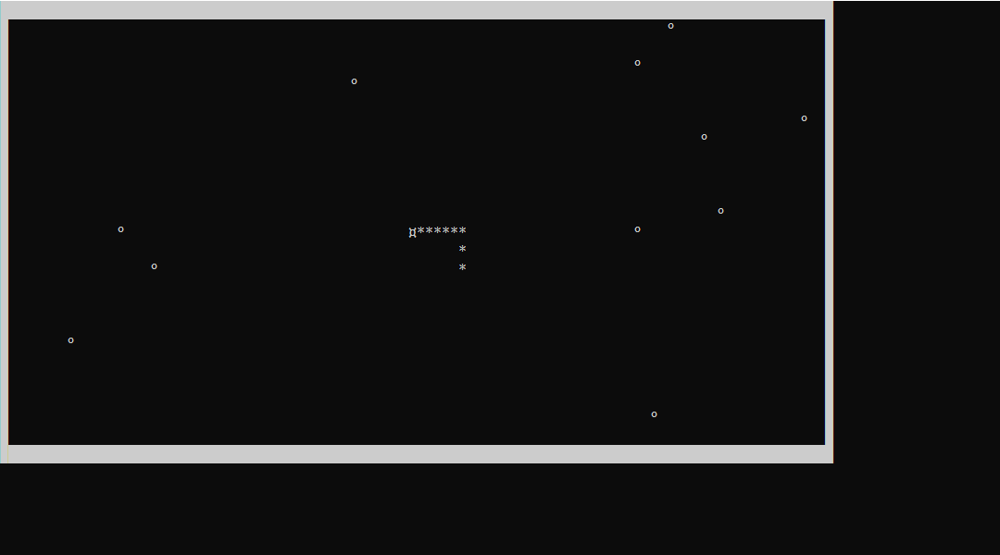

# Знакомство с PyGame + socket для создание игр.
>	My first step in CreateGames

## AgarIoRU
>Сетевая игра - микробы поедают меньших и становятся больше, но для поддержания размеров нужно кушать!  PyGame + socket

## Wagon and falling bird
>Простая ловля падающих предметов (Изучение PyGame)

## Первый блин комом (Отличные пример кода, неразобравшаись в возможностях библиотеке)
>Напоминание как не нужно писать код. Но есть видимая анимация!

## snake
>Консольная, всем известная игра змейка. 

>C++ : windows.h

 